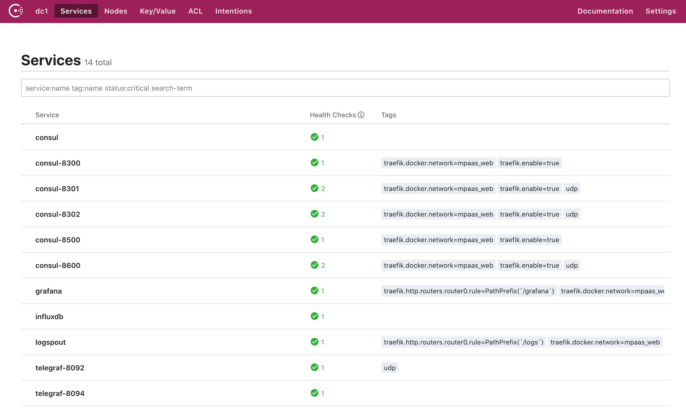

# Gryllidae 🦗

<sub>Pronunciation: (_grill-a-dee_)<sub>. 
	
> Most male crickets make a loud chirping sound by stridulation (scraping two specially textured limbs together)


An (opininated) collection of open-source [CNCF](https://cncf.io)-based Docker services that assist in making [12factor](https://12factor.net) applications.

**Future work** - Contribute to [awesome-compose](https://github.com/docker/awesome-compose).

## Table of Contents

- [What you get](#what-you-get)
- [What you end up with](#what-you-end-up-with)
- [Getting Started](#getting-started)
  - [**tl;dr** - How do we run this thing?](#are-we-there-yet)
- [Extending](#extending)
- [Troubleshooting](#troubleshooting)
  - [What is my Docker Compose "`image`"?](#what-is-my-image)
  - [I only have a `Dockerfile`... How do I use this?](#i-only-use-dockerfile-not-maven-what-now)
  - [The sirens are sounding, and there is no shelter nearby!!!](#what-is-going-wrong-everything-is-falling-apart)
- [canihazk8s-plz](#extras)?

## What you get

- Service Discovery
  - [Consul](https://www.consul.io/)
  - [Registrator](https://github.com/gliderlabs/registrator) (registers Docker containers with Consul as services)
- [Traefik](https://docs.traefik.io/) for load balancing & proxy against Consul<sup> \[1\]</sup> services
- [Logspout](https://github.com/gliderlabs/logspout) for [Log collection](https://12factor.net/logs)
- Metrics - The TIG Stack
  - [Telegraf](https://www.influxdata.com/time-series-platform/telegraf/) (metrics aggregator and pipeline) w/ [DataDog StatsD parser](https://docs.datadoghq.com/developers/dogstatsd/). Refer to [telegraf.conf](conf/telegraf/telegraf.conf) for customization options.
  - [InfluxDB 1.x](https://www.influxdata.com/) (metrics storage)
  - [Grafana](https://grafana.com/) (visualization)
  - **TODO**: Prometheus (PR's welcome) (Telegraf+Influx work fine, though. Telegraf can be configured to scrape Prometheus Metrics)
- Instrumentation
  - [Jaeger](https://www.jaegertracing.io/) (distributed tracing)

Any passwords for services are `instrument`. For example, Grafana creds are `admin:instrument`. InfluxDB can be queried using `instrument` as the password.

## What you end up with

### Consul - <http://localhost:8500>



### Logspout - <http://localhost:8000/logs>


### Traefik - <http://localhost:8080/dashboard>


### Grafana - <http://localhost:3000>

[Docker dashboard](https://grafana.com/grafana/dashboards/893) - id:`893`


[Telegraf dashboard](https://grafana.com/grafana/dashboards/928) - id:`928`, id:`5955`


### Jaeger - <http://localhost:16686>


## Getting Started

### Prerequisites

1. [Docker](https://docs.docker.com/get-docker/) 
  1. [Docker Compose[(https://docs.docker.com/compose/install/))
  2. **Admin-level user permissions** (a Docker requirement). 
2. `make` (installed by default on almost all Unix systems). If using Windows, [get WSL2](https://docs.microsoft.com/en-us/windows/wsl/wsl2-install). 
3. (optional) `git`. This way, you can ~subscribe to notifications~ easily pull the latest changes. 

> There are 10 types of people in the world, those who understand binary and those who don't.

With those few things in place, it's actual quiet simple. Either... 

- **(1)** You know a thing or two about `git`. 
- **(0)** You don't. In which case, [study up 📚](https://git-scm.com/doc)

download this repo as a ZIP (use the clone button) and extract it as a folder into your project as `.instrument`.

|Your binary state of mind|Action|
|-|-|
|**1**|`cd /some/path/to/project` <br> `git submodule add git@github.com:OneCricketeer/gryllidae.git .instrument`|
|Huh? (**0**)|[Click here](https://github.com/OneCricketeer/gryllidae/archive/master.zip), and/or keep reading.<br>Extract that to a `.instrument` folder inside your project|


Next, create a Docker network for the components

```sh
docker network create instrument_web
```

Then, if you are using your own `Makefile`, then add the `.instrument` make targets to it

```sh
echo -e '\ninclude .instrument/targets.mk' >> Makefile
```

Otherwise, since we've provided `make` targets for you, go ahead and create your own `Makefile`. (Trust me, using one is nicer than memorizing a bunch of Docker commands)

Here's a starting template. Note: `clean` and `install` should be updated to actually do things that are dependent on your own code. Also important: tabs matter when updating a `Makefile`.

```Makefile
install:
	@echo "installing!"

clean:
	@echo "cleaning!"

include .instrument/targets.mk
```

> _Alright, alright, alright!_

Having the infrastructure in place is great, **but** it doesn't help, you, _the application developer_, ensure your app will run on these services.
In order to test your _own app_ in this environment, [make your own `docker-compose.yml` file](https://docs.docker.com/compose/compose-file/)

Here's a starting template

```yaml
version: '3'
networks:
  instrument_web:
    external: true

## Update here
services:
  app:
    image: containous/whoami  # Replace with your own image
    ports:  # Update with your own ports
      - "8081:80"
    networks: ['instrument_web']  # This attaches to the underlying infrastructure network
    environment:  # Update with your environment
      FOO: bar
```

Next, add additional services that specify:

1. Any dependent services (such as [databases](https://github.com/bitnami/bitnami-docker-mariadb/blob/5.5.48/docker-compose.yml), [Kafka](https://github.com/confluentinc/cp-all-in-one/blob/5.5.0-post/cp-all-in-one-community/docker-compose.yml), etc.). Make sure to only copy the internal sections of any `services` block.
2. (Optional) Any [links to existing, external services](https://docs.docker.com/compose/networking/).

    If you use a remote service over the network, it is up to you to ensure you have the appropriate  network connectivity and firewall options from your machine to those.

   Best practices say to configure such connections via the  `environment` block of Compose or [in-app config wiring](https://12factor.net/config).

3. Externalized secrets

    > ***Note***: For simplicity, Hashicorp Vault is excluded from this stack.
    >
    >[Docker Compose can reference a `.env` file](https://docs.docker.com/compose/environment-variables/#the-env-file), should you need local credentials, otherwise use dummy credentials for test databases and such.
    >
    >**No one** responsible leaking access credentials in Git repos but yourself._

   ```sh
   # add to your gitignore
   echo -e '\n.env' >> .gitignore

   vim .env
   ```

### Are we there, yet?

YES!!!

With all that in place, write in your services (refer to Compose docs above as needed), then get ready to run your application(s)!

```sh
make ult-instrument
```

This will run until stopped via <kbd>Ctrl</kbd> + <kbd>C</kbd>.

## Extending

Hopefully the sevices listed above in [what you get](#what-you-get) are enough. Of course, feel free to mix-and-match with what you think is necessary.

## Troubleshooting

### It doesn't seem to work

Make sure you have the following file structure. Any extra files should include documentation and your local application code + build processes. As mentioned below, this has mostly been tested with Apache Maven, but NPM, or similar tooling could be build around this process.

```txt
.instrument/
  conf/
    grafana/
    telegraf/
      telegraf.conf
  targets.mk
  docker-compose.yml
Makefile
docker-compose.yml
```

### What is my `image`?

Are you stuck here?

```yaml
version: '3'
services:
   myapp:
      image: ???
```

You can either pull an image directly off [Docker Hub](https://hub.docker.com/), or more commonly, you are in development mode, and you are testing services locally. When an image is local, you can find it with `docker images`. 

When using any Docker image, the full image name would look like

```sh
[docker-registry]/[git-org]/[image-name]:[image-version]
```

Where each part of a full Docker image reference are:

1. (optional) Docker Registry
2. (optional) Docker Org/User
3. (**required**) Docker Image
4. (**preferred**) Image version

Without a registry specified, the default is [Docker Hub](https://hub.docker.com/). Use `docker images` to see what images are already downloaded on your local machine. Creating a Docker accont is free, and will let you create your own Docker Org/User where you can push images for others to use. 

If you exclude the image version, then it defaults to `latest`. Best practices of Docker say to always use a defined version. Preferabbly [SemVer](https://semver.org/), by which the `maven-release-plugin` can generate alongside the [Fabric8 `docker-maven-plugin`](https://dmp.fabric8.io/).

> Wait... [***Apache Maven***](https://apache.maven.org)?

Yes, you heard me right... Read on.

### I only use Dockerfile, not Maven, what now?

Maven is not only for Java apps! You _will_ need Java installed, but the featureset of Maven outweighs that burden.

As mentioned, the Fabric8 plugin works fine and has been tested with this project, so refer its documentation for configuration options. In general, it works similarly to the `maven-assembly-plugin` in that it bundles up the final build artifacts into a Docker image.

Other options for building Docker images from Maven include

- (My favorite) : [`jib-maven-plugin` by Google](https://github.com/GoogleContainerTools/jib/tree/master/jib-maven-plugin). Note: This is being merged into the Fabric8 Maven plugins - see [Eclipse JKube](https://github.com/eclipse/jkube).
- [Spotify Docker Maven Plugin (INACTIVE)](https://github.com/spotify/docker-maven-plugin) - It is stable and functional, but Jib builds more optimized images.

If you find Gradle, SBT, or another build tool works better for you, feel free to let us know.

### What is going wrong? Everything is falling apart!

*Relax. Breeeaathee.*

If everything started okay, logs from `stdout` / `stderr` of all the services will be `tail`'d.
They can also be followed in another tab (termainal or browser) via `curl http://localhost:8000/logs`. Refer [Logspout documentation](https://github.com/gliderlabs/logspout#including-specific-containers) on performing filters. Of course, `grep` works great here too.

Should a container die, you'll need to debug it.

Useful [commands](https://docs.docker.com/compose/reference/):

- `docker-compose ps` - See what's running (must be ran in same folder as the compose file)
- `docker-compose logs <name>` - dump the logs of that image. Include `logs -f <name>` to follow the logs.
- `docker-compose exec <name> bash` - can be used to shell into a container to inspect files and processes like any other terminal session.

## Extras

### I really like Minikube/Minishift and Helm

They are nice, sure, but Kube YAML is needlessly verbose for a local environment.
